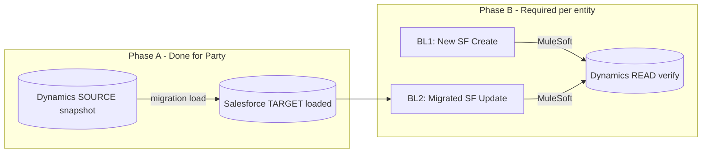

# Migration & Integration (Regression) Test Plan

**Parent:** [QA Test Plan Strategy and Approach](https://accelins.atlassian.net/wiki/spaces/SA/pages/2532114485/QA+Test+Plan+Strategy+and+Approach)  
**Confluence:** [Migration & Integration (Regression) Test Plan](https://accelins.atlassian.net/wiki/spaces/SA/pages/3330703367/Migration+Integration+Regression+Test+Plan)  
**Repo:** `docs/clm/CLM_GO_LIVE_MIGRATION_INTEGRATION_TEST_PLAN.md` · Features: `src/features/integration/clm-go-live/` · Env: `.env.int`

**BA source documentation (Confluence SA):**

| Document | Wiki | Local export |
|----------|------|--------------|
| ETL Process Overview and Key Principles | [3155165214](https://accelins.atlassian.net/wiki/spaces/SA/pages/3155165214/Data+Migration+from+Microsoft+Dataverse+to+Salesforce+ETL+Process+Overview+and+Key+Principles) | `docs/clm/confluence-sources/etl-overview-key-principles.md` |
| Per-Object Migration Procedures | [3180691488](https://accelins.atlassian.net/wiki/spaces/SA/pages/3180691488/Per-Object+Migration+Procedures) | `docs/clm/confluence-sources/per-object-migration-procedures.md` |

Refresh exports: `npm run docs:fetch:clm-ba-migration`

---

## Current status (May 2026)

| Item | Status |
|------|--------|
| **Salesforce INT data load** | **Complete (BA May 2026)** — all programme entities migrated to [arx--int](https://arx--int.sandbox.my.salesforce.com/) |
| **Product (SF-785) & Currency (SF-786)** | **In scope** — included in Phase A validation (MIG-020, MIG-021) |
| **Dynamics preprod** | Data in [accelinspreprod](https://accelinspreprod.crm11.dynamics.com/) |
| **MuleSoft ↔ Dynamics preprod** | **Not ready** — MuleSoft and Dynamics teams working on connectivity; **Phase B (lifecycle / sync) blocked** until go-ahead |
| **Automation access (PreProd)** | **Partial** — SF INT, Dynamics OData, SQL Server verified (see below); MuleSoft / Data Cloud still pending |
| **QA focus now** | **Phase A sign-off** — field/count validation across **all 18 entities** (load complete per BA) |
| **Live progress detail** | [CLM Migration — QA Progress (INT / preprod)](https://accelins.atlassian.net/wiki/spaces/SA/pages/3329785980) — counts, entity status, Party field validation evidence |

---

## Phase A — step status (parent + subpage aligned)

| Step | Description | Status (2026-05-20) | Evidence |
|------|-------------|---------------------|----------|
| **A1** | API smoke: Salesforce JWT + Dynamics WhoAmI / OData read | **Done** | `npm run int:connectivity-check` (2026-05-20) |
| **A2** | Record counts: Dynamics SOURCE vs Salesforce TARGET per entity | **In progress** | `@CLM-MIG-COUNTS` · RDM entities loaded on INT (May 2026 probe) — name-based correlation where `Dataverse_ID__c` absent |
| **A3** | Field-level validation: mapped attributes match (governance + picklists) | **In progress** | **Party (SF-736):** existence OK; address field diffs. **Transactional:** Party, contacts, member map, TPA map, country, product map. **RDM:** ASLOB, OSFI, COB, LOB, BEGAAP, Solvency II, MPP, POG, Sub Product — loaded on INT; validated via **Name** match (`accelins_name` → SF `Name`) when no correlation GUID field. |
| **A4** | Data Cloud: RDM visible in SF | **Pending** | Manual until Data Cloud API wired |

*Detail tables and entity list: [QA Progress subpage](https://accelins.atlassian.net/wiki/spaces/SA/pages/3329785980).*

---

## Environments

| System | URL |
|--------|-----|
| Salesforce INT | https://arx--int.sandbox.my.salesforce.com/ |
| Dynamics preprod | https://accelinspreprod.crm11.dynamics.com/ |

---

## Terminology (Salesforce vs Dynamics)

| Salesforce (INT) | Dynamics / Dataverse (preprod) |
|------------------|--------------------------------|
| **Account** | **Party** — OData entity set `accelins_parties` |
| Contact | `contacts` |
| Country | `accelins_countries` |

CLM migration and integration tests compare **Salesforce Account** to **Dynamics Party**, not to the standard Dataverse `accounts` entity (out of scope for this programme).

---

## BA migration approach (Dataverse → Salesforce ETL)

*Summarised from [ETL Overview](https://accelins.atlassian.net/wiki/spaces/SA/pages/3155165214) and [Per-Object Procedures](https://accelins.atlassian.net/wiki/spaces/SA/pages/3180691488). Full text in `docs/clm/confluence-sources/`.*

### Programme ETL stages (migration team)

| Stage | BA description | QA automation alignment |
|-------|----------------|-------------------------|
| **Extract** | Dataverse **SQL endpoint** → CSV to SharePoint *Dataverse Extract* | **Not automated** — QA uses **Dynamics OData read** on preprod as SOURCE truth (API equivalent, not CSV replay) |
| **Transform** | Excel working files, picklist maps, User/Party ID mapping tables, date normalisation (`yyyy-mm-ddThh:mm:ssZ`) | **Field compare rules** in Phase A must reflect transform outputs: `Picklist Value Mappings.xlsx`, governance M-tabs, audit-field skip policy |
| **Load** | **Workbench** CSV insert in **dependency order**; post-load SOQL mapping exports (`Dataverse_Id__c`) | Phase A validates **post-load TARGET** on SF INT vs SOURCE; does not re-run Workbench |

### BA key principles → test obligations

| Principle (BA) | What QA must prove |
|----------------|-------------------|
| Data integrity first | Phase A field compare; no silent pass on mismatches |
| Traceability | Every SF migrated row correlates via `Dataverse_ID__c` / `Dataverse_Id__c` (BA uses both spellings in docs) |
| Controlled transformations | Compare only governance-approved mappings (Include in Migration = Y) |
| Re-runnability | Rollback / upsert behaviour is **programme manual** (see BA rollback); QA documents INT state before lifecycle (Phase B) |

### Load dependency order (per BA runbook)

Work objects **in this order** — later loads depend on IDs from earlier objects. Phase A counts/field validation should respect readiness (entity blocked until upstream loaded on INT).

| Order | Dynamics (SOURCE) | Salesforce (TARGET) | Jira | Notes from BA procedures |
|------:|-------------------|---------------------|------|--------------------------|
| 0 | Users (Entra/Azure AD) | `User` | — | User ID mapping file required for CreatedBy/Owner on all objects |
| 1 | `accelins_party` | `Account` | SF-736 | Post-load: `SELECT Id, Dataverse_Id__c FROM Account`; deactivate **Account-RT-On Create/Update-Contract Validation** during import |
| 2 | `accelins_contact` | `Contact` | SF-738 | Party→Account lookup; duplicate emails → separate ACR manual load |
| 3 | `accelins_internal_contact` | `AccountTeamMember` | SF-737 | Inactive rows excluded; no inactive Users migrated |
| 4 | `accelins_membermapping` | `Member_Legal_Entity_Relationship__c` | SF-769 | `Reason = 'Migrated from RDM'` |
| 5 | `accelins_tpamaps` | `TPA_Maps__c` | SF-775 | TPA / TPA Group account lookups |
| 6 | `accelins_country` | `Country__c` | SF-739 | UNSD region via Alpha-2; picklist maps for Business Area / Distribution Region |
| 7+ | RDM reference objects | ASLOB, OSFI, COB, LOB, BEGAAP, Solvency II, Product Map, Sub Product, MPP, POG, Product | SF-780… | Valid From/To from Reference Data Audit History; bypass `Valid_To_Must_not_be_in_Past_on_Create` during import; Product Map effective dates per separate BA doc |

**SF object naming (verified arx--int May 2026):** Use `Classes_of_Business__c`, `Member_Product_and_Program__c`. Product migration target is `Product_ins__c` (legacy `Insurance_Product__c` also exists on INT — confirm with programme before SF-785).

**Correlation on INT (May 2026 probe):**
- **Transactional / mastered:** `Dataverse_ID__c` (Account, Contact, Member map, TPA map, Country, Product Map).
- **Internal contact:** `Internal_Contact_Master_ID__c` ↔ Dynamics `accelins_internal_contact_master_id` (no `Dataverse_ID__c` on AccountTeamMember).
- **RDM reference (ASLOB, OSFI, COB, LOB, BEGAAP, Solvency II, MPP, POG, Sub Product):** rows loaded on INT **without** `Dataverse_ID__c` — Phase A uses **Name** match (`accelins_name` → SF `Name`) and compares SF **total** count to Dynamics count.

**INT load method:** Workbench per BA runbook; QA validation uses **OData + SOQL/API only** (no CSV replay).

**Go/No-Go:** Full BA entity table for INT and prod (`CLM_MIGRATION_GONOGO_FULL_TABLE=true` default). Entities not loaded on INT fail A2 until provisioned.

**Count / existence exceptions (BA design):**
- External contact: up to **37** Dynamics rows may be absent from Contact (duplicate → ACR manual load).
- Internal contact: **833** AccountTeamMember rows on INT; inactive / departed-user Dynamics rows excluded (`countMatchMode: sf-lte-dynamics`).
- Product map: SF **total** may be up to **32 rows higher** than preprod extract — change-history rows added on INT (`countSfHigherTolerance: 32`).
- Currency: no custom object — validated via **CurrencyType** ISO codes + **Dataverse_Mapping__mdt** `functional_currency__c` rows.

### Pre-load / post-load checks (BA) vs QA Phase A

| BA pre-requisite (all objects) | In QA automation today? |
|--------------------------------|------------------------|
| Permission set: Set Audit Fields + Update Records with Inactive Owners | **Partial** — Phase A audit step compares Owner/CreatedBy/LastModifiedBy via Azure AD user map |
| Bypass validation permission on migration user | **No** — manual |
| Master ID fields as **Text** during import, revert to Auto Number post sign-off | **No** — post-migration state assumed on INT |
| Post-load reconciliation SOQL mapping files | **Partial** — API compare uses live probed `Dataverse_ID__c`, not Workbench export CSV |

### Programme Go / No-Go (production migration)

BA defines gates before **production** load (RDM clean-up, UAT sign-off, Workbench access, audit permissions, rollback plan, stakeholder availability). **INT QA** uses the **full BA entity table** for Go/No-Go: all in-cycle entities must pass A2/A3 when loaded. Track BA Go/No-Go table on Confluence; link sign-off milestones to Zephyr cycle **QA Migration-Intg - Regression Testing**.

### Rollback (production — BA)

On critical failure: halt loads → download Workbench errors → delete partial inserts → fix root cause → re-run (Upsert on Master ID). **Not in test automation** — document as programme runbook; INT may refresh sandbox instead.

### How Phase A maps to BA “validation and reconciliation”

BA states validation/reconciliation **post-load**. Our automation implements that as:

- **A2** — row counts SOURCE (Dynamics OData `$count`) vs TARGET migrated (`COUNT()` where correlation field populated)
- **A3** — field-level SOURCE vs TARGET for governance mappings + picklist translation
- **A4** — Data Cloud visibility (separate from Workbench ETL)

**After Phase A sign-off:** Salesforce becomes master; Dynamics read-only for lifecycle — see [Phase B](#phase-b--lifecycle-change-validation-blocked-mulesoft-preprod-scope-gap).

---

## End-to-end landscape (INT / preprod)

High-level data and integration paths covered by this test plan. **Account** = Salesforce; **Party** = Dynamics.

```
┌─────────────────────────────────────────────────────────────────────────────┐
│                        CLM GO-LIVE — E2E TEST LANDSCAPE                      │
└─────────────────────────────────────────────────────────────────────────────┘

  [Dynamics preprod RDM]                    [Salesforce INT]
  accelinspreprod.crm11                     arx--int.sandbox
         │                                        │
         │  ◄── Phase A: Migration validate ──► │  CRM (mastered data loaded)
         │      (Party, Contact, Country, RDM)   │  Data Cloud (RDM landing)
         │                                        │
         │  ◄── Phase B: Lifecycle (C/U) ─────── │  SF Create/Update only
         │      via MuleSoft (when ready)         │  (D365 read-only for mastered)
         │      NEW records + UPDATES to          │  Platform Events
         │      migrated rows in SF               │
         │                                        │
         ▼                                        ▼
  [MuleSoft INT] ──────────────────────────► [Party / entities sync]
         ▲                                        │
         └── Dynamics preprod: READ for verify ───┘  (no mastered writes in D365)

  [FiveTran] ──► [ADP / Snowflake] ──► Phase C: MEMBER_WRITTEN_PREMIUM_VS_PLAN_V2
                      │                      zero-copy federation → SF CRM
                      ▼
  [ODS / TDS / SQL] ──► [Tagetik]     Phase D: downstream smoke
  [Duck Creek] [D365 F&O]

  [Bordereaux written + claim files] ──► Phase E: Member / Product lifecycle impact
```

**Legend:** Solid arrows = in-scope validation; Phase B blocked until MuleSoft ↔ Dynamics preprod is live.

---

## Test phases overview

Phases run **in order**. Do not start the next phase until the exit gate for the current phase is met.

| Phase | Name | Status (May 2026) | What we test | Entry gate | Exit gate |
|-------|------|-------------------|--------------|------------|-----------|
| **—** | **Connectivity / access** | **Partial** | JWT, Dataverse OData, SQL read | `.env.int` | SF + D365 + SQL checks pass |
| **A** | **Migration validation** | **Active now** | Post-load **reconciliation** per BA ETL: Dynamics SOURCE vs SF INT (counts + fields); aligns with BA “validation at each stage” | Data loaded in INT per [load order](#load-dependency-order-per-ba-runbook); **A1 + A2 done**; **A3 in progress** (Party done) | QA + Data sign-off; no P0 mismatches on in-scope loaded entities |
| **B** | **Lifecycle change validation** | **Blocked — scope not fully implemented** | SF **Create** (new records) + SF **Update** (migrated rows); D365 **read-only** verify only | Phase A signed off; Mule preprod live | **Both** lifecycle paths pass per entity (see [Phase B](#phase-b--lifecycle-change-validation-blocked-mulesoft-preprod)) |
| **C** | **ADP & Data Cloud** | Pending | `MEMBER_WRITTEN_PREMIUM_VS_PLAN_V2`, zero-copy, FiveTran | Phase B (or parallel if approved) | Federation + sync healthy |
| **D** | **Downstream** | Pending | ODS/TDS, Tagetik, Duck Creek, D365 F&O | Phase B | Smoke pass per interface |
| **E** | **Bordereaux load** | Pending | Written + claim files; new & existing members | Phase B | No adverse lifecycle impact |
| **Go-live** | **PROD recommendation** | — | — | A–E exit criteria met | Programme go/no-go |

```
Phase flow (sequential):

  [Access] ──► [A Migration] ──► [B Lifecycle] ──► [C ADP/Data Cloud]
                      │                │                    │
                      │                └───────┬────────────┘
                      │                        ▼
                      │              [D Downstream] ──► [E Bordereaux] ──► GO-LIVE
                      │
                      └── (Product SF-785 added to A/B when migrated)
```

| Phase | Automation (repo) |
|-------|-------------------|
| Access | `npm run int:connectivity-check` |
| A | `npm run test:clm:go-live:migration` · `CLM-MIGRATION-VALIDATION.feature` |
| B | `npm run test:clm:go-live:integration` · `SF-736`, `SF-769`, … |
| C | `CLM-GL-INT-002` |
| D | `CLM-GL-INT-003` |
| E | `CLM-GL-INT-004` |

---

## Connectivity verification (2026-05-20)

Read-only checks from the automation framework (`ENV=int`, `.env.int`). **No records created.**

| Check | Result | Notes |
|-------|--------|-------|
| **Salesforce INT JWT** | **Pass** | User `qa-automation@accelins.com.int` → org **Accelerant** on `https://arx--int.sandbox.my.salesforce.com` |
| **Salesforce API read** | **Pass** | `SELECT Id, Name FROM Organization LIMIT 1` |
| **Dynamics preprod SPN** | **Pass** | WhoAmI on `https://accelinspreprod.crm11.dynamics.com/api/data/v9.2/` |
| **Dataverse OData (read)** | **Pass** | SPN can query preprod Dataverse (Party `accelins_parties`, Country, Contact verified in automation smoke) |
| **SQL Server (ODS / TDS / Tagetik)** | **Pass** | Read access to preprod SQL (`sql-pre-uks-01` / TDS) — ServiceNow access provisioned; `.env.int` configured |
| **MuleSoft OAuth** | **401** | Credentials in `.env.int` not valid for INT yet — **optional for Phase A**; required before Phase B |

**Framework config fixes applied:** `src/config/env/int.json` added; `ENV=int` set in `.env.int` (was incorrectly `qamerge` from copy). INT Connected App: use **`QA_UI_Automation_App_INT`** (or equivalent) if QA org copy caused duplicate OAuth metadata on the original name.

**Re-run commands (repo):**

```bash
npm run int:connectivity-check
npx ts-node scripts/int-dataverse-query-smoke.ts   # ENV=int
```

**Phase A gate A1:** **Met** for Salesforce INT + Dynamics preprod (Dataverse OData read).

---

## PreProd automation access

The E2E framework (`ENV=int`, `.env.int`) needs approved access across PreProd / INT systems.

| System | Purpose | Setup (`.env.int`) | Status |
|--------|---------|-------------------|--------|
| **Salesforce INT** | API + UI tests, migration read, lifecycle | JWT via **Connected App** (`SF_CLIENT_ID` / `SF_JWT_CLIENT_ID`, cert, `SF_JWT_USERNAME`) | **Verified** — JWT + API read OK (2026-05-20); Connected App created for INT (use INT-specific API name if copied from QA) |
| **Dynamics preprod** | Migration compare, lifecycle verify | SPN / app registration (`D365_*`) | **Verified (read)** — Dataverse OData OK; with **Ana** for additional privileges if needed |
| **SQL Server** (ODS / TDS / Tagetik) | Downstream SQL smoke | `SQLSERVER_*` in `.env.int` | **Verified (read)** — preprod SQL access via ServiceNow; host `sql-pre-uks-01` |
| **MuleSoft** | Log trace, INT env routing | `MULESOFT_*`, INT application names | **Blocked (401)** — update INT Mule credentials when preprod routing is ready |
| **Salesforce Data Cloud** | RDM landing, zero-copy federation | `SF_DATA_CLOUD_*` (TBD) | Pending |
| **ADP / Snowflake** | `MEMBER_WRITTEN_PREMIUM_VS_PLAN_V2` read-only | `SNOWFLAKE_*` | Pending |
| **FiveTran** | Dynamics → ADP sync monitoring | API or dashboard (TBD) | Pending |
| **Duck Creek** | Interface smoke | INT credentials (TBD) | Pending |
| **D365 F&O** | Finance smoke | `D365_FO_*` preprod | Pending |
| **Bordereaux ingest** | Written + claim test files | Paths + ingest access (TBD) | Pending |

**Until access is complete:** manual validation where possible; partial automation (SF-only); evidence on this Confluence page.

**Exit for access workstream:** `.env.int` complete; `npm run int:connectivity-check` green; Dataverse entity reads OK for in-scope migration objects.

---

## What we must prove before PROD

1. **Migration** — Loaded data in SF INT matches Dynamics preprod (except Product until migrated).
2. **Lifecycle change validation (SF → D365)** — After migration, **Salesforce is the system of record** for mastered objects; **Dynamics preprod becomes read-only** for those entities (no post-migration mastered writes in D365). QA must prove **both** paths: **(a)** net-new records created in Salesforce sync to Dynamics, and **(b)** **migrated** records (already correlated via `Dataverse_ID__c`) receive **updates** in Salesforce and those changes sync to the **existing** Dynamics row — **not** implemented end-to-end in automation today (see Phase B).
3. **ADP / Data Cloud** — `MEMBER_WRITTEN_PREMIUM_VS_PLAN_V2` federated to CRM; FiveTran Dynamics → ADP healthy.
4. **Downstream** — ODS/TDS, Tagetik, Duck Creek, D365 F&O smoke.
5. **Bordereaux** — Test written + claim files; no harm to Member/Product lifecycle.

**Order:** See [Test phases overview](#test-phases-overview) — A → B → C / D / E → go-live.

---

## Phase A — Migration validation *(active now)*

See **[Phase A — step status](#phase-a--step-status-parent--subpage-aligned)** above for the canonical A1–A4 table (same content as the [QA Progress](https://accelins.atlassian.net/wiki/spaces/SA/pages/3329785980) subpage).

| Step | What | Status |
|------|------|--------|
| **A1** | API smoke: SF JWT + Dynamics WhoAmI / OData read | **Done** (2026-05-20) |
| **A2** | Counts: Dynamics vs SF per entity (`@CLM-MIG-COUNTS`) | **Done** (2026-05-20) — 4 entities fully migrated; 1 partial; 13 not on INT |
| **A3** | Field-level: mapped SOURCE vs TARGET (`@CLM-MIG-PARTY`, …) | **Party done**; other loaded entities next |
| **A4** | Data Cloud: RDM visible (manual until API wired) | **Pending** |

**In scope for migration checks** (loaded in SF INT — validate against Dynamics preprod):

| # | Jira | Domain | Salesforce (API) | Dynamics / Dataverse (preprod) |
|---|------|--------|------------------|--------------------------------|
| 1 | SF-736 | Account → **Party** | `Account` | **Party** — `accelins_parties` |
| 2 | SF-737 | Contact (Internal) | `Contact` | `contact` |
| 3 | SF-738 | Contact (External) | `Contact` | `contact` |
| 4 | SF-739 | Country | `Country__c` | `accelins_country` |
| 5 | SF-769 | Member / Legal Entity / Group relationship | `Member_Legal_Entity_Relationship__c` | `accelins_membermap` |
| 6 | SF-775 / SF-788 | TPA Maps | `TPA_Maps__c` | `accelins_tpamap` |
| 7 | SF-766 | Sub Product | `Sub_Product__c` | `accelins_subproduct` |
| 8 | SF-767 | Product Maps | `Product_Map__c` | `accelins_productmapping` |
| 9 | SF-779 | Member Products and Programs | `Member_Product_and_Program__c` | `accelins_memberproduct` |
| 10 | SF-780 | ASLOB | `ASLOB__c` | `accelins_aslob` |
| 11 | SF-781 | Class of Business | `Classes_of_Business__c` | `accelins_classofbusiness` |
| 12 | SF-782 | Line of Business | `Line_of_Business__c` | `accelins_lineofbusiness` |
| 13 | SF-783 | BEGAAP COB | `BEGAAP_COB__c` | `accelins_begaapcob` |
| 14 | SF-784 | Solvency II | `Solvency_II__c` | `accelins_solvencyii` |
| 15 | SF-786 | Currency | `Currency__c` | `transactioncurrency` |
| 16 | SF-798 | OSFI | `OSFI__c` | `accelins_osfi` |
| 17 | SF-872 | Product reference data (RDM tables) | Per SF-872 object set | Per RDM table in Dynamics |

**Out of scope for migration checks (this week):**

| Jira | Domain | Reason |
|------|--------|--------|
| SF-785 | Product | **Migrated (BA May 2026)** — Phase A MIG-020 |

**Automation:** `CLM-MIGRATION-VALIDATION.feature` (`@CLM-MIG-COUNTS`, `@CLM-MIG-PARTY`), `npm run test:clm:go-live:migration` · `npm run test:clm:go-live:migration:counts`

---

## Phase B — Lifecycle change validation *(blocked: MuleSoft preprod; scope gap)*

Do not start until MuleSoft–Dynamics preprod connectivity is confirmed **and** Phase A is signed off for the entity under test.

### Post-migration operating model (programme assumption)

Once an entity is **migrated** to Salesforce INT (Phase A complete for that object):

| System | Role after go-live |
|--------|-------------------|
| **Salesforce INT** | **Master** — all lifecycle **Create** and **Update** for that object happen here |
| **Dynamics preprod** | **Read-only** for mastered attributes — used to **verify** sync outcomes; QA does **not** PATCH Parties/contacts/RDM in D365 to simulate business change |
| **MuleSoft** | One-way (or programme-defined) sync **SF → D365** on platform events / integration contracts |

Phase B is **not** a repeat of Phase A (bulk compare). It proves that **ongoing change** in Salesforce is reflected correctly in Dynamics.

### Mandatory lifecycle test cases *(per mastered entity)*

Every in-scope object needs **both** paths below before Phase B exit. Use a **traceable field change** (name, status, mapped attribute) and correlation id (`Dataverse_ID__c` or equivalent).

| ID | Path | Preconditions | Action in Salesforce | Expected in Dynamics (read verify) | Automation today |
|----|------|---------------|----------------------|-----------------------------------|------------------|
| **B-L1** | **New record (post-migration create)** | Entity migrated; SF mastering active | **Create** new row via API/UI with required fields; activate / qualify per eligibility (e.g. Account_Status__c → Active) | **New** correlated Dynamics row created; `Dataverse_ID__c` populated on SF after SLA | **Partial** — SF-736 / SF-769 / SF-788 packs include API **Create** flows (greenfield `Dataverse_ID__c` null → populated). Not yet rolled out for all CLM entities on INT. |
| **B-L2** | **Migrated record (update)** | Pick existing SF row from **Phase A** population (`Dataverse_ID__c` already set from migration) | **Update** same SF record (field change) | **Same** Dynamics GUID updated — field values match SF; **no** duplicate Party/entity row | **Not done** — **no dedicated automated scenario** that selects a **migrated** fixture, updates SF, and asserts update (not create) on the existing Dynamics row. **This is a programme gap.** |
| **B-L3** | **Dynamics read-only guard** | Mastering policy in effect | Attempt or confirm **no** direct D365 write path for mastered lifecycle (document manual negative if API blocks writes) | No new lifecycle-driven changes originating in D365 for mastered objects | **Not done** — document / manual checklist only |
| **B-L4** | **Ineligible / no-sync** | Eligibility rules | Create/update ineligible SF state | No erroneous Dynamics row / `Dataverse_ID__c` stays null | **Partial** — e.g. SF-736 ineligible scenarios; extend per entity |



**Highlight — current gap:** Programme orchestration (`CLM-GL-INT-001-mastered-lifecycle.feature`) and per-Jira packs **do not yet** enforce **B-L2** (update of **migrated** records) as a standard regression for every entity. SF-736-style tests focus heavily on **create-then-sync**; explicit **“update migrated Account → existing Party”** coverage must be added to features and step definitions before Phase B can be signed off.

### Per-Jira automation packs (building blocks)

| Pack | Jira | Covers today | Gap vs B-L1 / B-L2 |
|------|------|--------------|-------------------|
| Account → Party | SF-736 | API Create, Update, ineligible, timeliness | **B-L1** largely; **B-L2 on migrated fixture** not explicit |
| Member / LE / Group | SF-769 | Platform events, member maps | Extend **B-L2** after migration load |
| TPA Maps | SF-788 | TPA create/update events | Extend **B-L2** |
| Product Maps / CMDT | SF-796 | CMDT resolution | Lifecycle C/U TBD |
| Product reference RDM | SF-872 | RDM CRU | Lifecycle C/U TBD |

**Orchestrator:** `CLM-GL-INT-001-mastered-lifecycle.feature` — `@CLM-GL-INT-020` outline (Create then Update) is **`@pending-step-def`**; must implement **B-L1** and **B-L2** per row in Examples.

**Run (when unblocked):** `npm run test:clm:go-live:integration` with `ENV=int`.

### Phase B exit criteria (add to go-live gate)

- [ ] **B-L1** passed for each P0 entity on INT (or documented waiver).
- [ ] **B-L2** passed for each P0 entity — **update** on at least one **migrated** record per object, Dynamics row verified read-only from SF change.
- [ ] **B-L3** documented (D365 write policy confirmed with programme).
- [ ] MuleSoft log / platform-event evidence attached (Confluence or Zephyr cycle).

---

## Phases C–E

| Phase | Focus |
|-------|--------|
| **C** | ADP, Data Cloud zero-copy, FiveTran |
| **D** | ODS/TDS, Tagetik, Duck Creek, F&O |
| **E** | Bordereaux written + claim |

---

## Issues / risks / challenges

| # | Issue | Impact | Mitigation / status |
|---|--------|--------|---------------------|
| 1 | **No lower ADP environment** | Cannot run full Phase C (`MEMBER_WRITTEN_PREMIUM_VS_PLAN_V2`) against non-prod ADP; limited to **read-only prod ADP** only if programme approves | Defer ADP federation to Phase C; document approval for prod read; use Data Cloud / FiveTran monitoring where possible |
| 2 | **MuleSoft integration to Dynamics preprod not complete** | **Phase B blocked** — cannot validate SF mastered Create/Update → Party sync end-to-end | Track with MuleSoft + Dynamics teams; stay on **Phase A** until connectivity go-ahead; update INT `MULESOFT_*` in `.env.int` |
| 3 | **MuleSoft OAuth (INT credentials)** | Automation cannot pull Mule logs on INT yet (401) | Obtain INT-specific Connected App / env IDs when routing is ready |
| 4 | **Product (SF-785) not migrated this week** | Migration and lifecycle tests for Product deferred | Re-scope Phase A/B when load date confirmed |
| 5 | **INT sandbox copied from QA** | Duplicate OAuth metadata / Connected App naming issues | Use INT-specific app name (e.g. `QA_UI_Automation_App_INT`) |
| 6 | **PreProd automation access incomplete** | Data Cloud, FiveTran, Duck Creek, F&O, Bordereaux paths not fully automated | ServiceNow / Ana for remaining systems; manual evidence where needed |
| 7 | **Data Cloud zero-copy / federation** | Phase C cannot complete without INT object names and connector access | Pending env vars and data-team manifest |
| 8 | **Lifecycle change validation incomplete** | **B-L2 (update migrated SF records)** and full **B-L1** per entity **not** in CLM go-live automation; risk of go-live without proving SF-mastered updates on migrated data | Add scenarios to `CLM-GL-INT-001` + per-Jira features; tag Zephyr under SF-1235 / entity stories; block Phase B sign-off until matrix above is green |

**Highest risk to go-live date:** Items **1**, **2**, and **8** — ADP constraints, MuleSoft preprod readiness, and **missing migrated-record update validation**.

---

## Exit criteria (go-live)

- Phase A signed off (Product excluded until loaded).
- Phase B passed for P0 objects once MuleSoft preprod is live — including **new SF create (B-L1)** and **migrated SF update (B-L2)** per entity; Dynamics verified **read-only** for mastered lifecycle (B-L3).
- C–E per programme priority; no open P0 defects.

---

## Roles

| Role | Now |
|------|-----|
| QA | Phase A automation; **Connected App** for SF INT; SQL access via ServiceNow (done) |
| Ana | **Dynamics preprod SPN** access for automation |
| Data / Migration | Sample IDs, Product load date |
| MuleSoft + Dynamics | Preprod connectivity — **gate for Phase B** |
| Programme lead | Go/no-go |

---

*Version 2.3 — 2026-05-21 (BA ETL overview + per-object procedures incorporated; Confluence export in docs/clm/confluence-sources/)*

**Publish:** `npm run docs:upload:clm-go-live-test-plan` (page `3330703367`) · `npm run docs:upload:clm-migration-progress` (subpage `3329785980`)
