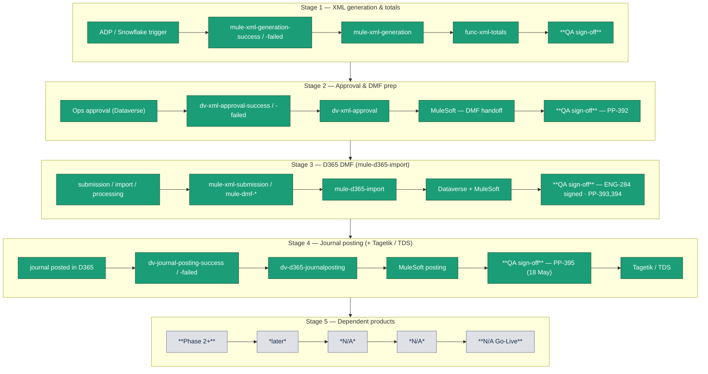
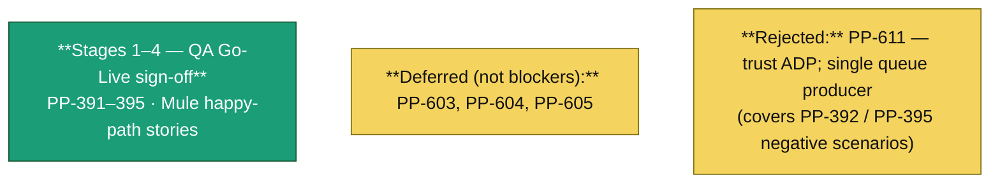

# Lloyd’s pipeline — QA progress (R / Y / G)

**Confluence:** [QA progress (R / Y / G)](https://accelins.atlassian.net/wiki/spaces/TM/pages/3220078705/QA+progress+R+Y+G) · **Publish:** `npm run docs:upload:lloyds-qa-progress` (credentials in `src/config/env/.env.qa`)

Edit **colours** in Mermaid (`:::g` / `:::y` / `:::r` / `:::o`). **Queues & messages:** [`SKILL.md`](./SKILL.md) §3–4.

---

## Programme verdict (**2026-05-17**)

**Go-Live position:** QA has **signed off** the Lloyd’s **Stages 1–4 happy path** in the QA environment. End-to-end behaviour needed for initial production use has been exercised and accepted for release.

**Scope of sign-off:** Sign-off covers the **primary operational flow** (XML generation through journal posting and related integrations). It is **not** a claim that every edge case or failure mode is fully implemented in QA.

**Unhappy / negative path:** Some negative-scenario and error-handling gaps are **known and accepted for Go-Live**. Where architect and development have confirmed design intent (e.g. **ADP as the trusted source**, controlled Service Bus producers), items may be **closed or deferred** rather than fixed in this phase. **Further negative-path hardening is expected in a later programme phase** — see the bug register (§1.2).

**Reporting:** There are **known limitations in operational reporting and status visibility**. Engineering and the **business team are aligned** on what is available at Go-Live versus what will follow in post–Go-Live iterations.

**Reversals:** **Reversal** scenarios **cannot be fully validated in lower environments** because of how Lloyd’s data and environments are set up. **Production (or production-like) verification** is recommended for that path after Go-Live.

**Defect tracking:** Open and accepted defects are listed in **§1.2** (Jira export **15 May**, **26** bugs). None of the open items above are treated as **Go-Live blockers** for the happy path.

---

## Legend

| Colour | Meaning |
|--------|--------|
| **Green** | QA verified / Go-Live sign-off |
| **Yellow** | Deferred defect or Phase 2 |
| **Red** | Open programme blocker (none for Go-Live) |
| **Grey** (`:::o`) | Out of scope Phase 1 |

---

## 1) End-to-end flow





### 1.1) Power Platform — D365 journal ([PP-390](https://accelins.atlassian.net/browse/PP-390))

| Story | Jira status (export) | QA sign-off |
|-------|---------------------|-------------|
| [PP-391](https://accelins.atlassian.net/browse/PP-391) Capture source & XML summaries | Ready for release | **Signed** |
| [PP-392](https://accelins.atlassian.net/browse/PP-392) 2-file approval (source vs XML) | In QA → signed | **17 May** |
| [PP-393](https://accelins.atlassian.net/browse/PP-393) DMF import submission & tracking | Ready for release | **Signed** |
| [PP-394](https://accelins.atlassian.net/browse/PP-394) Import monitoring & error handling | Ready for release | **Signed** |
| [PP-395](https://accelins.atlassian.net/browse/PP-395) Monitor journal posting | In QA → signed | **18 May** (negative cases → PP-611 rejected) |

### 1.2) Complete bug register (**26** — export **Lloyds QA Bugs**, **15 May**)

| Key | P | Jira status | Summary | QA disposition |
|-----|---|-------------|---------|----------------|
| [ENG-269](https://accelins.atlassian.net/browse/ENG-269) | H | Ready for release | Duplicate XML blobs / PROCESS_TRACKER — Mule dedupe | Accepted for Go-Live |
| [ENG-270](https://accelins.atlassian.net/browse/ENG-270) | H | Ready for release | F&O `ImportFromPackage` HTTP 400 after blob download | Accepted for Go-Live |
| [ENG-280](https://accelins.atlassian.net/browse/ENG-280) | H | Ready for release | Mule XML missing rows from ADP | Accepted for Go-Live |
| [ENG-283](https://accelins.atlassian.net/browse/ENG-283) | M | Ready for release | Financials sync — weak / missing log on tracker mismatch | Accepted for Go-Live |
| [ENG-284](https://accelins.atlassian.net/browse/ENG-284) | Hi | Ready for release | Dimension validation — missing Fabric tables on Dev | **QA signed off** |
| [ENG-285](https://accelins.atlassian.net/browse/ENG-285) | H | Ready for release | Posted journal — Tagetik TDS not loaded | Accepted for Go-Live |
| [ENG-287](https://accelins.atlassian.net/browse/ENG-287) | M | Ready for release | CloudHub — no XML on Dev after trigger | Accepted for Go-Live |
| [ENG-288](https://accelins.atlassian.net/browse/ENG-288) | M | Ready for release | PROCESS_TRACKER stages incomplete for `MULE_FNO_Journal_E2E` | Accepted for Go-Live |
| [ENG-290](https://accelins.atlassian.net/browse/ENG-290) | M | Ready for release | Workflow Completed not in PROCESS_TRACKER | Accepted for Go-Live |
| [ENG-291](https://accelins.atlassian.net/browse/ENG-291) | M | Ready for release | Error_Log timestamp not shown on Dev | Accepted for Go-Live |
| [ENG-292](https://accelins.atlassian.net/browse/ENG-292) | H | Ready for release | XML gen fail — PROCESS_TRACKER / error log not updated | Accepted for Go-Live |
| [ENG-293](https://accelins.atlassian.net/browse/ENG-293) | M | Ready for release | Awaiting approval mismatch — no DLQ message | Accepted for Go-Live |
| [ENG-294](https://accelins.atlassian.net/browse/ENG-294) | H | Ready for release | Approved XMLs — journals not uploaded to F&O GC | Accepted for Go-Live |
| [ENG-295](https://accelins.atlassian.net/browse/ENG-295) | M | Ready for release | Journal posting fail — no error log when message in DLQ | Accepted for Go-Live |
| [ENG-297](https://accelins.atlassian.net/browse/ENG-297) | H | Ready for release | One F&O journal vs multiple approved repo XMLs | Accepted for Go-Live |
| [ENG-299](https://accelins.atlassian.net/browse/ENG-299) | H | Ready for release | Posted journal not in Silver `ledgerjournaltable` (E2E) | Accepted for Go-Live |
| [ENG-300](https://accelins.atlassian.net/browse/ENG-300) | H | Ready for release | Posted journals status not reflected in Power Apps | Accepted for Go-Live |
| [ENG-301](https://accelins.atlassian.net/browse/ENG-301) | Hi | Ready for release | `correlation_Id` vs `correlationId` — Tagetik flow not triggered | Accepted for Go-Live |
| [ENG-302](https://accelins.atlassian.net/browse/ENG-302) | M | Ready for release | Tagetik not loaded but PROCESS_TRACKER shows Completed | Accepted for Go-Live |
| [ENG-308](https://accelins.atlassian.net/browse/ENG-308) | M | Ready for release | Declined XML — incorrect workflow status | Accepted for Go-Live |
| [ENG-309](https://accelins.atlassian.net/browse/ENG-309) | M | Ready for release | Manual approve with mismatch — ambiguous dimension error log | Accepted for Go-Live |
| [PP-597](https://accelins.atlassian.net/browse/PP-597) | M | **Done** | Invalid correlation id on DMF paths → DLQ | Accepted for Go-Live |
| [PP-603](https://accelins.atlassian.net/browse/PP-603) | M | **In QA** | Retry when journal posted but no `dv-journal-posting-success` | **Deferred** — not Go-Live blocker |
| [PP-604](https://accelins.atlassian.net/browse/PP-604) | M | **In QA** | Posting does not validate D365 computed fields | **Deferred** — not Go-Live blocker |
| [PP-605](https://accelins.atlassian.net/browse/PP-605) | M | **In QA** | 5-day SLA breach — no ServiceNow ticket | **Deferred** — not Go-Live blocker |
| [PP-611](https://accelins.atlassian.net/browse/PP-611) | M | In Progress | FA does not validate XML FileName / CorrelationID (PP-392-UI-004) | **Rejected** — trust ADP; single producer on queue |

**Counts:** Ready for release **21** · Done **1** · In QA **3** · In Progress **1** (PP-611 → rejected).

**Note:** [ENG-289](https://accelins.atlassian.net/browse/ENG-289) (DMF fail / ServiceNow) is referenced in story comments but **not** in this bug export filter.

### 1.3) Mule happy-path stories (work items export)

**Ready for release:** ENG-53, 54, 55, 56, 167, 168, 179, 271, 272, 278, 79, 81, 178 · PP-475 · PP-13, 71, 273, 460.

**Phase 2 / out of Go-Live:** ENG-47 (epic blocked), ENG-86/89/57 (ResQ), ENG-50, error epics ENG-166/176/111.

### 1.4) E2E read-only automation

`npm run test:lloyds:e2e-readonly` · `ENV=qa` · `LLOYDS_E2E_READINESS_ACK=1`

Refresh matrix: `npm run test:lloyds:e2e-readonly` → `npm run lloyds:repo-matrix` → `npm run docs:upload:lloyds-qa-progress:matrix`

<!-- LLOYDS_REPO_MATRIX_INJECT -->

---

## 2) Automation entry points

| Area | Command / feature |
|------|-------------------|
| Stage 1 hops | `lloyds-pipeline-hops.feature` · `npm run test:lloyds:hops` |
| E2E read-only (17 repos) | `lloyds-pipeline-e2e-readonly.feature` · `npm run test:lloyds:e2e-readonly` |
| Strategy / SKILL | [`LLOYDS_TEST_STRATEGY.md`](./LLOYDS_TEST_STRATEGY.md), [`SKILL.md`](./SKILL.md) |

---

## 3) Publish to Confluence

```bash
npm run docs:upload:lloyds-qa-progress
```

---

## 4) Reference

### 4.0.1 Agency cohort — seventeen repository ids

[`lloydsClonedRepoCohort.ts`](../../src/integrations/lloyds/lloydsClonedRepoCohort.ts) → **`LLOYDS_PROGRAMME_REPOSITORY_IDS`**.

### 4.3.1 Dev environment — ADP summary noise

Filter **`_ACCEL_REPOSITORY_ID`**; order by **`_ACCEL_STD_TABLE_ROW_CREATED_TIMESTAMP DESC`**.
