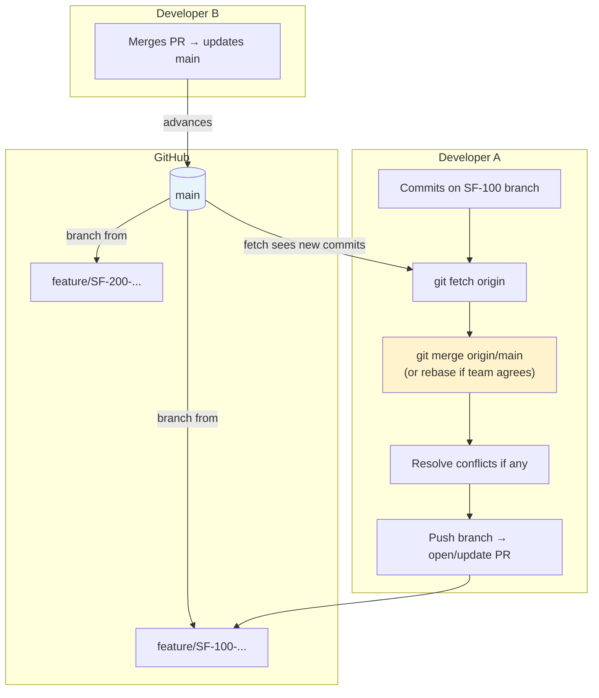
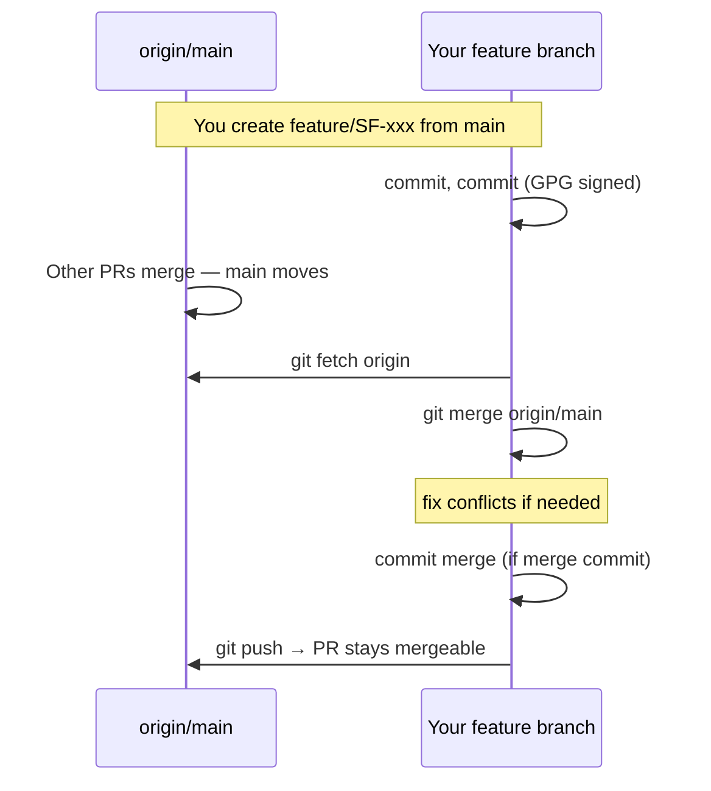
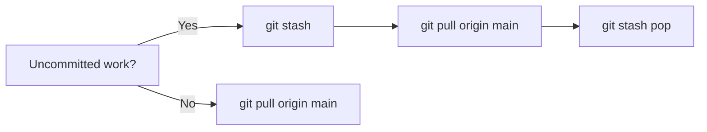

# Code review and branching — visual diagrams

These diagrams match **[CODE_REVIEW_AND_CONTRIBUTION.md](CODE_REVIEW_AND_CONTRIBUTION.md)** and **[GIT_SYNC_WITH_MAIN.md](GIT_SYNC_WITH_MAIN.md)**.

**How to view:** GitHub/GitLab (native Mermaid), VS Code with a Mermaid extension, or paste into [Mermaid Live Editor](https://mermaid.live).

---

## 1. Code review process (PR to `main`)

```mermaid
flowchart TB
    subgraph Prep["Author — before PR"]
        M[("main on GitHub")]
        B[Create branch<br/>feature/&lt;JIRA&gt;-description]
        W[Work locally<br/>GPG-signed commits]
        V[Run local checks<br/>build, lint, validate:steps, targeted tests]
        P[Push branch to origin]
        M --> B --> W --> V --> P
    end

    subgraph PR["Pull request"]
        O[Open PR + template<br/>Jira key, sprint, validation notes]
        R[Reviewer(s)<br/>count set by GitHub admin]
        Q{Changes<br/>requested?}
        F[Author pushes updates<br/>signed commits]
        A[Approve]
        O --> R --> Q
        Q -->|Yes| F --> R
        Q -->|No| A
    end

    subgraph Close["Merge & hygiene"]
        MG[Merge to main<br/>often squash — admin policy]
        CL[Branch delete when practical]
        A --> MG --> CL
    end

    P --> O
    MG --> M

    style M fill:#e8f4fc
    style MG fill:#d4edda
    style V fill:#fff3cd
```

**Notes (not shown as boxes):** no secrets in repo; reuse framework patterns in review; optional biweekly office hours instead of standing review meetings.

---

## 2. Keeping your branch current with `main` (team workflow)

Each contributor works on a **feature branch** while **`main` moves forward** as others merge PRs. You periodically bring **`origin/main`** into your branch so you do not drift.



### Same idea as a timeline (simplified)



---

## 3. If you are on `main` locally (quick reference)



For **feature-branch** detail and **rebase** cautions, see [GIT_SYNC_WITH_MAIN.md](GIT_SYNC_WITH_MAIN.md).

---

*Diagrams last updated March 2026.*
